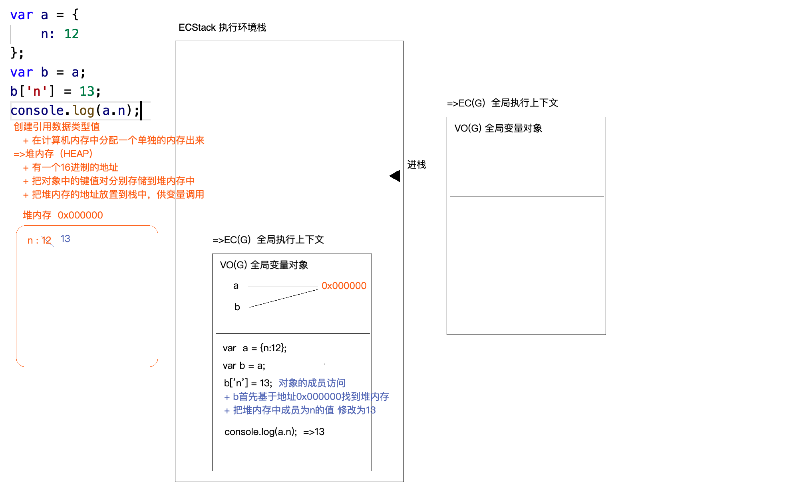

# JS 中的堆栈内存及函数底层处理机制

## JS 中的数据类型

- 基本数据类型（值类型、原始类型）
- 引用数据类型

> 详见脑图

## 常用检测数据类型

```js
typeof
```

## typeof 的原理

- 所有的数据类型值在计算机中存储的都是按照“二进制”存储的
- null -> 000000
- 只要是对象都是以 000 开始的
- typeof 检测的时候，是按照计算机存储的二进制的值来检测的

```js
Infinity === Infinity; // true
NaN === NaN; // false
-Infinity === Infinity; // flase

// 如何检测是不是有效数字
let n = 10;
isNaN(n); //true
```

## Symbol

- 唯一值
- 不能 new

```js
// console.log(new Symbol()); //Uncaught TypeError: Symbol is not a constructor

console.log(Symbol('AA') === Symbol('AA')); //false
let symb = Symbol('BB');
console.log(symb === symb); //true

// 给对象设置唯一的属性
// vuex/redux 中做行为派发的时候，统一管理派发的行为标识，标识的值可以是唯一值
// + .....
Symbol.hasInstance
Symbol.toPrimitive
Symbol.toStringTag
Symbol.iterator
Symbol.isConcatSpreadable
Symbol.match
...
```

## bigint 超大数字

在数字后面加个 n

```js
Number.MAX_SAFE_INTEGER; //最大安全数字
9007199254740991;
Math.pow(2, 53);
9007199254740992;

let a = 9007199254740991n + 3n; // a = 9007199254740994n;

typeof a; // bigint
```

# 栈内存 Stack & 堆内存 Heap

## 栈内存 Stack

- declare & defined
- ECStack（Execution [ˌeksɪˈkjuːʃn] Context Stack）执行环境栈
- EC（Execution Context ）执行上下文
- GO（Global Object）全局对象
- VO（Varibale Object）变量对象
  - 存储当前上下文声明的变量

```js
/*
第一步先创建值
  ＋基本类型值是直接存储在 栈内存中
  ＋引用类型值都是开辟个 单独的内存空间（堆内存 Heap）用来存储信息的

第二步声明变 declare
  + 存故到当前上下文的变量对象中（VO/AO)

第三步
  + 让变和值关联到一起也就是所谓的赋值操作此 此作叫做定义delned
*/
var a = 12;
/*
var n; 只声明变量n,只做了第2步。 值是undefined

词法分析，右侧优先计算
*/

var b = a;
b = 13;
console.log(a);
```

### 基本类型和引用类型的区别

- 基本类型值存储在栈内存中，直接按值操作
- 引用数据类型值是开辟单独的堆内存存储信息，操作的是引用地址

## js 代码的运行环境

- 浏览器
- node
- webview

## 图解





## 作业

```js
var a = { n: 1 };
var b = a;
a.x = a = { n: 2 };
console.log(a.x);
console.log(b);
```

js 运算符优先级

https://developer.mozilla.org/zh-CN/docs/Web/JavaScript/Reference/Operators/Operator_Precedence

成员访问优先级最高

a.x = a = { n: 2 };

- 先创建一块堆内存{ n: 2 } 地址 x000001
- 为 a 添加成员 x
- 让 a.x = x000001
- 然后再让 a 等于 x000001

```js

// 等同于
a.x = {n:2} // b = a = { n:1, x:{n:2}}
a = {n:2}   // b = { n:1, x:{n:2}}  a = {n:2}

console.log(a.x); // undefined
console.log(b);

=>{
  n:1,
  x:{
    n:2
  }
}

```


## 函数的底层处理机制

- EC（Execution Context ）
- AO（Active Object）
- SCOPE
- SCOPE-CHAIN


## i++ 和 ++i

```js
/*
  i++和++i的区别(数学运算)：在自身的基础上累加1
  i++ 先拿原始i的值进行运算，运算结束后，i再累加1
  ++i 先让自身累加1，累加后拿最新的结果进行运算处理
*/
let i = 1;
console.log(5 + i++); //6  5+i -> i++
i = 1;
console.log(5 + ++i); //7  ++i -> 5+i
```
