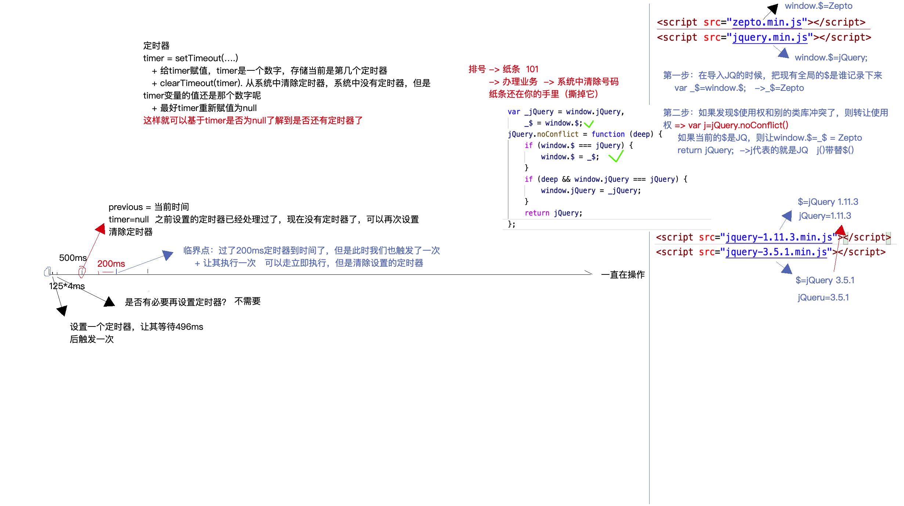

# 防抖和截流

## 防抖 debounce

### 简介

- 防止频繁点击

### 详细设计

> 创建一个 debounce 功能，该功能将延迟调用 func 直到自上次调用 debounce 功能以来的“等待”毫秒后，或者直到绘制下一个浏览器框架为止。debounce 功能带有取消方法，可以取消延迟的功能调用，而刷新方法则可以立即调用它们。提供“options”以指示是否应在“wait”超时的前沿和/或后沿调用“ func”。 使用提供给去抖动功能的最后一个参数来调用`func`。 随后对去抖动功能的调用将返回上一次`func`调用的结果。 -- lodash 里的注释翻译

```js
function debounce(func, wait = 300, immediate = false) {
  //
}

function handler() {
  console.log('handler');
}

btn.onclick(debounce(handle));
```

## 截流

### 简介

- 控制事件触发过于频繁，降低函数执行频率

### 详细设计

> 创建一个节流函数，每个函数最多只能调用一次`func` 每“等待”毫秒（或每个浏览器框架一次）。 节流函数带有“cancel”方法来取消延迟的“func”调用，以及“flush”方法来立即调用它们。 提供“选项”以指示是否应在“等待”超时的前沿和/或后沿调用“func”。 使用提供给节流函数的最后一个参数调用`func`。 随后对节流函数的调用返回上一次`func`调用的结果。

```js
function throttle(func, wait, options) {
  //
}

function handle() {
  // do sth
}
window.onscroll = throttle(handler, 500);
```

## 总结

- 实现的原理
  - 利用闭包，为要执行的函数做一个代理
  - 这个代理在函数执行前，启动一个 timeout 定时器
  - 如果有多余的操作进来，通过重制定时器来取消掉多余的操作
  - 直到定时器结束，执行函数


