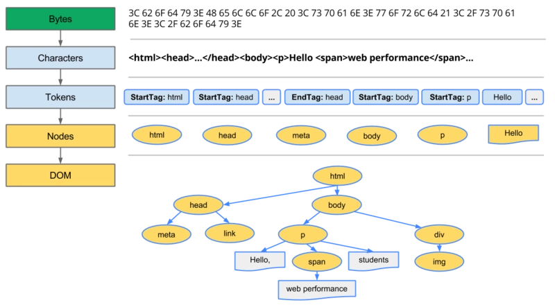
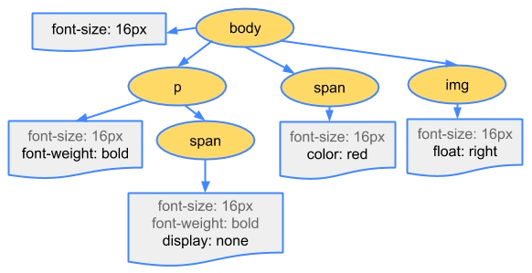
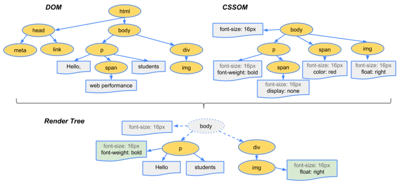
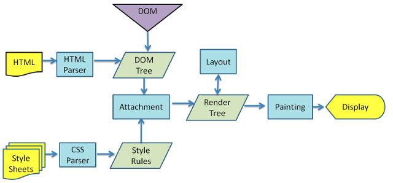

# 浏览器底层渲染机制和性能优化

客户端从服务器获取到需要渲染页面的源代码后
「开辟一个“GUI 渲染线程”，自上而下解析代码，最后绘制出对应的页面」

### DOM 树

### CSSOM 树

### Render-Tree 渲染树

### 1.关于 CSS 资源的加载

- 遇到的是\<style> “内嵌样式”
  - “同步” 交给 GUI 渲染线程解析
- 遇到的是<link> “外链样式”
  - “异步” 开辟一个新的“HTTP 网络请求线程”
  - 注意：同一个源下，根据不同的浏览器，最多只允许同时开辟 4 ～ 7 个 HTTP 线程 “HTTP 的并发数”
  - 不等待资源信息请求回来，GUI 渲染线程继续向下渲染
  - GUI 渲染线程同步操作都处理完成后，再把基于 HTTP 图片络线程请求回来的资源文件进行解析渲染
- 遇到@import “导入式样式”

  - “同步” 开辟一个新的“HTTP 网络请求线程”去请求资源文件
  - 但是在资源文件没有请求回来之前，GUI 渲染线程会被“阻塞”，不允许其继续向下渲染

### 2.遇到\<script>资源的请求

- 默认都是“同步”的：必须基于 HTTP 网络线程，把资源请求回来之后，并且交给“JS 渲染线程”渲染解析完成后，GUI 渲染线程才能继续向下渲染，所以\<script>默认也是“阻碍 GUI 渲染”的
- async 属性：遇到\<script async>首先也是开辟一个 HTTP 网络线程去请求加载资源文件，与此同时 GUI 渲染线程继续向下渲染「把默认的同步改为“异步”」，但是一旦当资源请求回来后，会中断 GUI 的渲染，先把请求回来的 JS 进行渲染解析
- defer 属性：遇到\<script defer> 和 async 类似，都是新开辟 HTTP 网络线程去请求加载资源文件，与此同时 GUI 还会继续渲染「“异步”」，但是不一样的地方是，defer 和 link 类似，是在 GUI 同步的代码渲染完成后，才会渲染解析请求回来的 JS 代码

### 3.遇到\或者音视频资源

- 遇到这些资源，也会发送新的 HTTP 网络线程，请求加载对应的资源文件，不会阻碍 GUI 的渲染「“异步”」；当 GUI 渲染完成后，才会把请求回来资源信息进行渲染解析；

## 页面渲染的步骤：

- DOM TREE（DOM 树）：自上而下渲染完页面，整理好整个页面的 DOM **结构**关系
- CSSOM TREE（样式树）：当把所有的样式资源请求加载回来后，按照引入 CSS 的顺序，依次渲染样式代码，生成**样式**树
- RENDER TREE（渲染树）：把生成的 DOM 树和 CSSOM 树合并在一起，生成渲染树（_设置 display:none 的元素不进行处理_）
- Layout 布局/回流/重排： 根据生成的渲染树，计算它们在设备视口(viewport)内的确切位置和大小
- 分层处理：按照层级定位分层处理，每一个层级都有会详细规划出具体的绘制步骤
- Painting：按照每一个层级计算处理的绘制步骤，开始绘制页面
