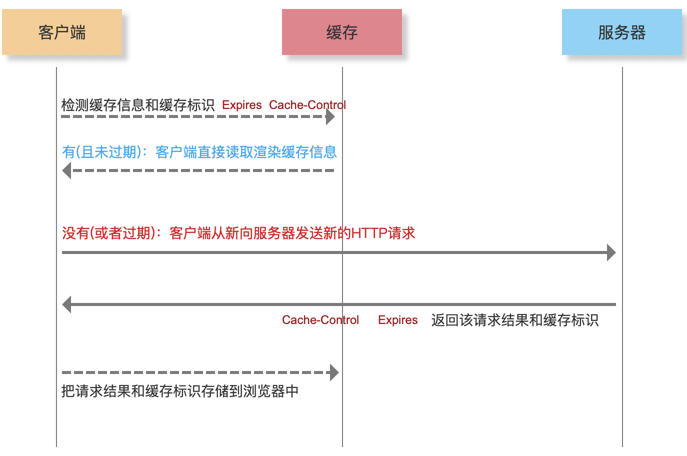

# 缓存机制

## 简介

都是对资源文件的缓存处理，数据的缓存不是这样处理的

## 缓存位置

- Memory Cache : 内存缓存
- Disk Cache：硬盘缓存

## 强缓存 Expires / Cache-Control

```
Expires：Tue, 01 Dec 2020 13:50:37 GMT HTTP1.0
Cache-Control：max-age=14400 HTTP1.1
```



- 服务器设置的，并且基于响应头信息返回给客户端的（nginx 这些发布工具直接搞定的）；客户端浏览器接收到响应后，会自己建立缓存机制（不需要前端自己写代码）；

- 第一次请求，没有缓存，直接从服务器获取「缓存标识 Expires/Cache-Control」，客户端拿到内容后，把信息和标识缓存到本地；
- 第二次请求，检测本地是否有缓存「检查是否过期」，如果没过期，则直接基于缓存信息渲染；如果没有或者过期，重复上一步；
- 是否走缓存，HTTP 状态码都是 200；

#### 强缓存存在的问题？

- 客户端缓存信息了，但是服务器的资源文件更新了「项目新版本上线部署」，这样导致用户无法及时获取到服务器最新资源信息！！
- xxx.html 这种页面是不进行强缓存的
- xxx.css/js/png...可以强缓存：因为 html 没有强缓存，所以每一次 html 都是从服务器获取的，如果其它资源文件服务器有更新，我们只需要在 html 中导入资源的时候做处理即可
  - 导入路径后面设置时间戳
  - 资源文件的名字在内容发生更改后，名字会重新生成「HASH 名字 ->webpack」

## 协商缓存 Last-Modified / ETag

- 协商缓存(客户端需要和服务器协商)：在强缓存失效的情况下，协商缓存的机制才会触发

```
Last-Modified/If-Modified-Since:Tue, 02 Apr 2019 04:33:32 GMT HTTP1.0
ETag/If-None-Match:"700e28-17667-58584a3b7eca0" HTTP1.1
```


- 下面都是认为没有强缓存或者强缓存失效了
- 第一次请求，没有任何缓存，直接从服务器获取资源和标识 Last-Modified/ETag(状态码返回的是 200)，页面渲染同时，存储到本地；

- 第 N 次请求，检测本地是否有存储的标识，如果没有认为没缓存，重复上一个步骤，如果有：
  - 基于标识 If-Modified-Since/If-None-Match，把之前存储的 Last-Modified/ETag 结果，传递给服务器
  - 服务器收到结果做匹配
    - 服务器端一般这样处理的，在项目文件部署的时候，会生成 Last-Modified/ETag 对应的值，这个值代表当前项目文件在服务器上最后一次更新的时间或者对应的标识
    - 接收到客户端传递的结果，和之前存储的值进行比较
      - 如果一致说明文件没有更新，给客户端直接返回 304 状态码即可
      - 如果不一致说明文件有更新，则把最新的文件信息及标识信息重新返回给客户端，状态码是 200
  - 客户端收到响应后，判断状态码
    - 304，把之前缓存的文件拿出来渲染
    - 200，按照最新的文件渲染，同时更新本地的缓存

> 所以 html 页面完全可以设置协商缓存，而其余的资源文件一般是两种都设置！

## 数据缓存


