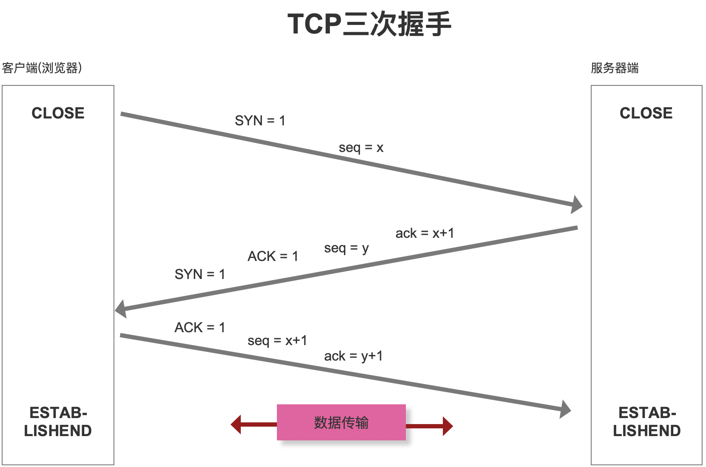
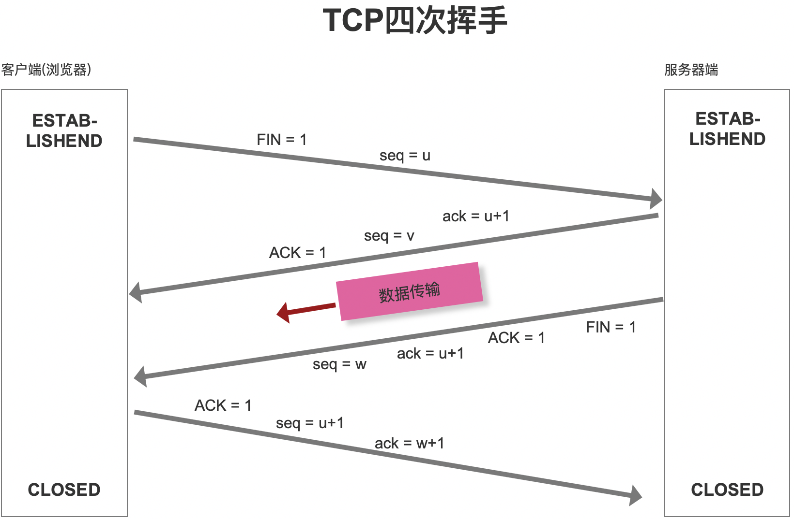
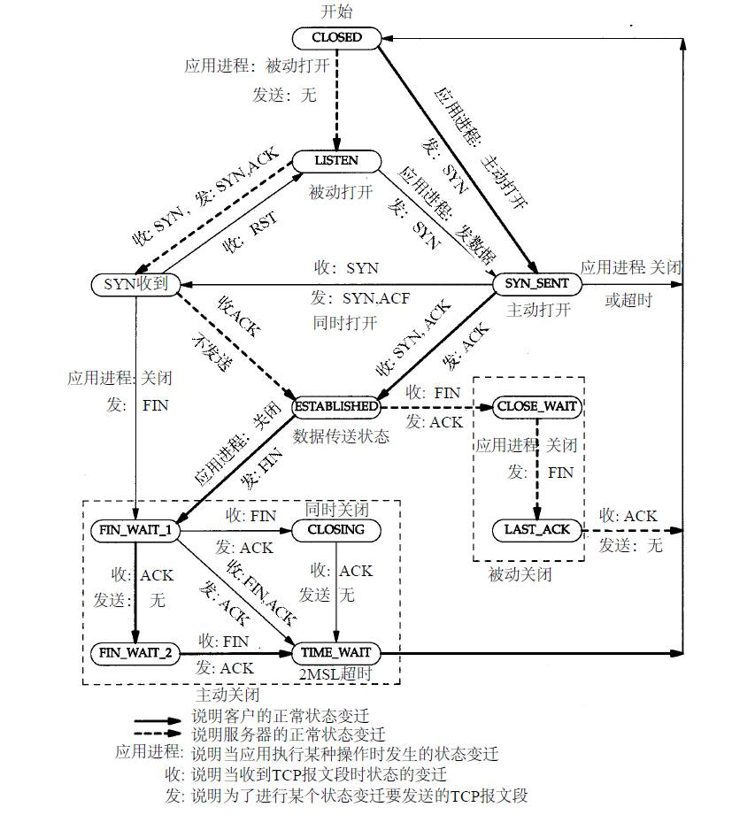

# TCP/IP 协议

## 简介

面向**连接**的**可靠**协议

底层是 scoekt

> UDP 就是无连接的，不可靠的协议

## 三次握手 Three-way Handshake

刚开始客户端处于 Closed 的状态，服务端处于 Listen 状态。

#### 第一次握手

客户端给服务端发一个 SYN 报文，并指明客户端的初始化序列号 ISN(c)。此时客户端处于 SYN_SEND 状态。

首部的同步位 SYN=1，初始序号 seq=x，SYN=1 的报文段不能携带数据，但要消耗掉一个序号。

#### 第二次握手

服务器收到客户端的 SYN 报文之后，会以自己的 SYN 报文作为应答，并且也是指定了自己的初始化序列号 ISN(s)。同时会把客户端的 ISN + 1 作为 ACK 的值，表示自己已经收到了客户端的 SYN，此时服务器处于 SYN_RCVD 的状态。

在确认报文段中 SYN=1，ACK=1，确认号 ack=x+1，初始序号 seq=y。

#### 第三次握手

客户端收到 SYN 报文之后，会发送一个 ACK 报文，当然，也是一样把服务器的 ISN + 1 作为 ACK 的值，表示已经收到了服务端的 SYN 报文，此时客户端处于 ESTABLISHED 状态。服务器收到 ACK 报文之后，也处于 ESTABLISHED 状态，此时，双方已建立起了连接。

确认报文段 ACK=1，确认号 ack=y+1，序号 seq=x+1（初始为 seq=x，第二个报文段所以要+1），ACK 报文段可以携带数据，不携带数据则不消耗序号。

### SYN 攻击是什么？

其实第三次握手的时候，是可以携带数据的。但是，第一次、第二次握手不可以携带数据。

服务器端的资源分配是在二次握手时分配的，而客户端的资源是在完成三次握手时分配的

SYN 攻击就是 Client 在短时间内伪造大量不存在的 IP 地址，并向 Server 不断地发送 SYN 包，Server 则回复确认包，并等待 Client 确认，由于源地址不存在，因此 Server 需要不断重发直至超时，这些伪造的 SYN 包将长时间占用未连接队列，导致正常的 SYN 请求因为队列满而被丢弃，从而引起网络拥塞甚至系统瘫痪。SYN 攻击是一种典型的 DoS/DDoS 攻击。

常见的防御 SYN 攻击的方法有如下几种：

- 缩短超时（SYN Timeout）时间
- 增加最大半连接数
- 过滤网关防护
- SYN cookies 技术

### 小结

主要是在确认，自己的输入和输出，没有问题

也就是确认双方的接收能力和发送能力是否正常

握手结束以后，建立**连接**成功

双方都建立了资源，为对方服务。

## 四次挥手

#### 第一次挥手

客户端发送一个 FIN 报文，报文中会指定一个序列号。此时客户端处于 FIN_WAIT1 状态。
即发出连接释放报文段（FIN=1，序号 seq=u），并停止再发送数据，主动关闭 TCP 连接，进入 FIN_WAIT1（终止等待 1）状态，等待服务端的确认。

#### 第二次挥手

服务端收到 FIN 之后，会发送 ACK 报文，且把客户端的序列号值 +1 作为 ACK 报文的序列号值，表明已经收到客户端的报文了，此时服务端处于 CLOSE_WAIT 状态。
即服务端收到连接释放报文段后即发出确认报文段（ACK=1，确认号 ack=u+1，序号 seq=v），服务端进入 CLOSE_WAIT（关闭等待）状态，此时的 TCP 处于半关闭状态，客户端到服务端的连接释放。客户端收到服务端的确认后，进入 FIN_WAIT2（终止等待 2）状态，等待服务端发出的连接释放报文段。

#### 第三次挥手

如果服务端也想断开连接了，和客户端的第一次挥手一样，发给 FIN 报文，且指定一个序列号。此时服务端处于 LAST_ACK 的状态。
即服务端没有要向客户端发出的数据，服务端发出连接释放报文段（FIN=1，ACK=1，序号 seq=w，确认号 ack=u+1），服务端进入 LAST_ACK（最后确认）状态，等待客户端的确认。

#### 第四次挥手

客户端收到 FIN 之后，一样发送一个 ACK 报文作为应答，且把服务端的序列号值 +1 作为自己 ACK 报文的序列号值，此时客户端处于 TIME_WAIT 状态。需要过一阵子以确保服务端收到自己的 ACK 报文之后才会进入 CLOSED 状态，服务端收到 ACK 报文之后，就处于关闭连接了，处于 CLOSED 状态。
即客户端收到服务端的连接释放报文段后，对此发出确认报文段（ACK=1，seq=u+1，ack=w+1），客户端进入 TIME_WAIT（时间等待）状态。此时 TCP 未释放掉，需要经过时间等待计时器设置的时间 2MSL 后，客户端才进入 CLOSED 状态。

### 为什么是四次？

ACK 报文是用来应答的，SYN 报文是用来同步的。

因为当服务端收到客户端的 SYN 连接请求报文后，可以直接发送 SYN+ACK 报文。

断开连接,涉及释放各自的资源。

第二次挥手只是确认第一次挥手收到。

> 服务端告诉客户端："你发的 FIN 报文我收到了，但是我的报文还没有发送完毕."

第三次挥手和第二次挥手之间在传输数据。

> 服务端告诉客户端："报文发送完毕了，我们可以分手了！"

第三次挥手是确认传输结束。

## 总结

三次握手 + 数据传输 + 四次挥手 是一个原子化的过程不能拆分

