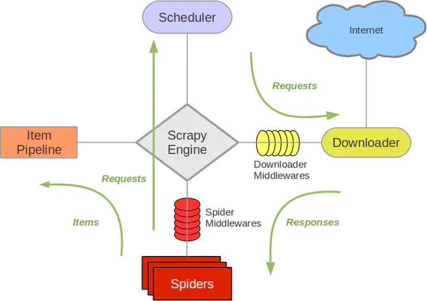

# Scrapy

[官网](https://scrapy.org/)

[中文站点](https://scrapy-chs.readthedocs.io/zh_CN/latest/index.html)

An open source and collaborative framework for extracting the data you need from websites.

In a fast, simple, yet extensible way.

一个开源和协作框架，用于从网站中提取您需要的数据。

以一种快速、简单但可扩展的方式。



## 主要特点：

- 快速，强大
- 易于扩展
- 使用方便

## 具体特点

- 高性能的数据解析，请求发送
- 持久化存储
- 全站数据爬取
- 中间件

## 入门简介

### 安装

```
pip install scrapy

scrapy
Scrapy 2.6.1 - no active project

Usage:
  scrapy <command> [options] [args]

Available commands:
  bench         Run quick benchmark test
  commands
  fetch         Fetch a URL using the Scrapy downloader
  genspider     Generate new spider using pre-defined templates
  runspider     Run a self-contained spider (without creating a project)
  settings      Get settings values
  shell         Interactive scraping console
  startproject  Create new project
  version       Print Scrapy version
  view          Open URL in browser, as seen by Scrapy
```

### 项目初始化(创建工程)

```
scrapy  startproject ProjectName
```

### 创建爬虫源文件

```
cd HelloWorld

scrapy genspider spiderName www.zyte.com
```

### 执行爬虫

```
scrapy crawl hello
```

默认输出所有的相关工程里的日志

## 配置简介

settings.py

- 禁止 robots 协议
- 指定 LOG_LEVEL
- UA 伪装

## 数据解析

xpath
