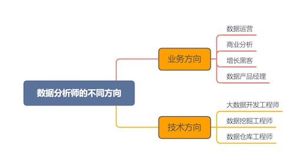

# 数据分析师技术栈

## 职业发展方向

---

## 初级技能

### 基础

- [x] 概率论
- [ ] 统计学
- [x] 编程语言

### 分析工具

- [ ] Excel
- [ ] SQL
- [ ] BI 产品（Business Intelligence）

---

## 中级

### python 相关库

- [ ] Numpy 科学计算的基础包
- [ ] Pandas 数据分析支持库
- [ ] Matplolib 数据可视化
- [ ] Django Web 框架
- [ ] Scikit-learn

### 核心技能

#### 数据获取

- [ ] 寻找开源数据
- [ ] 爬取网络数据

#### 数据处理

- [ ] 数据清洗及标准化
- [ ] 数据库管理

#### 分析方法

- [ ] 描述统计
- [ ] 推断验证

#### 数据挖掘

- [ ] 算法模型：回归，分类，聚类
- [ ] 特征工程：特征提取及优化

### 项目分析

- [ ] 可视化数据分析图表
- [ ] 数据分析报告
- [ ] 商业决策，业务应用
